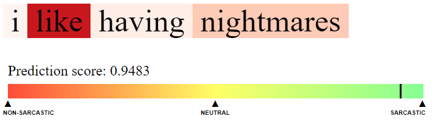
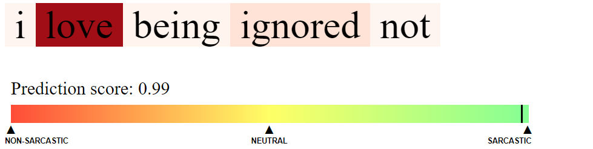

# Machine Learning and Deep Learning Approaches to Sarcasm Detection

Sarcasm detection — often quoted as a subtask of sentiment analysis — with a fine-tuned
**DistilBERT** classifier, a **Streamlit** web app, and a per-token attention heat-map
showing where the model looked.

Originally an MSc dissertation project (2020) built on a Bidirectional LSTM with Attention
over ELMo vectors. That pipeline no longer runs on any current stack; see
[Legacy (2020) pipeline](#legacy-2020-pipeline) for what happened and what was kept.




---

## Quick start

```bash
pip install -r requirements.txt
streamlit run app.py
```

The app needs a trained model. Either train one (below) and unzip it into
`Code/pkg/trained_models/distilbert-sarcasm/`, or point it at a HuggingFace Hub repo:

```bash
export SARCASM_MODEL_ID=your-username/distilbert-sarcasm-headlines
```

There is also a command-line interface, which writes the heat-map to `Code/colorise.html`:

```bash
python Code/console.py
```

## Training

Open [`notebooks/train_distilbert.ipynb`](notebooks/train_distilbert.ipynb) in Google Colab,
set the runtime to a **T4 GPU**, fill in `REPO_URL` and `HF_REPO_ID` in the config cell, and
run it top to bottom. Takes about five minutes.

The notebook merges both News Headlines files, de-duplicates, trains, evaluates against a
TF-IDF + Logistic Regression baseline, writes `metrics.json`, and optionally pushes the
weights to the HuggingFace Hub.

To rebuild the CSV used by the legacy pipeline:

```bash
python Code/pkg/datasets/news_headlines/processing_scripts/p1_create_raw_csv.py
```

## Results

Populated from `metrics.json` after you run the training notebook. On the held-out 10% of
28,503 de-duplicated headlines, expect DistilBERT to land around **92–94% accuracy**
against roughly **~84%** for the TF-IDF baseline.

| Model | Accuracy | F1 |
|---|---|---|
| TF-IDF + Logistic Regression | _run the notebook_ | |
| DistilBERT (fine-tuned) | _run the notebook_ | |

### Two caveats worth stating plainly

- **Source bias.** Every sarcastic headline in this corpus is from *The Onion* and every
  non-sarcastic one from *HuffPost*. Some of what the model learns is publication house
  style, not sarcasm. The `article_link` column is dropped during processing because the
  domain literally *is* the label, but the writing style still correlates. Read the number
  as "accuracy on this dataset", not as general-purpose sarcasm detection.
- **Attention is not attribution.** The heat-map shows where the model attended. That is an
  interpretability aid, not evidence of what caused the decision.

## Deploying to Streamlit Community Cloud

1. Push this repo to GitHub. The model weights are **not** committed — `.gitignore`
   excludes `Code/pkg/trained_models/*`.
2. Create the app at [share.streamlit.io](https://share.streamlit.io), pointing at `app.py`.
3. Under **App settings → Secrets**, add:
   ```toml
   SARCASM_MODEL_ID = "your-username/distilbert-sarcasm-headlines"
   ```

`requirements.txt` pins the **CPU** PyTorch wheel via `--extra-index-url`. This matters: on
Linux the default PyPI `torch` is the CUDA build, roughly 2.5 GB, which overruns the Cloud
disk budget.

## Layout

```
app.py                                  Streamlit web app
Code/console.py                         CLI
Code/pkg/data_processing/cleaning.py    clean_for_model() — shared by training and serving
Code/pkg/model_training/transformer.py  model loading, prediction, attention extraction
Code/pkg/analysis/attention_html.py     heat-map renderer (used by both front-ends)
notebooks/train_distilbert.ipynb        Colab training notebook
```

## Dependencies

Pinned in [`requirements.txt`](requirements.txt) (app runtime) and
[`requirements-dev.txt`](requirements-dev.txt) (adds training, data processing and the
legacy analysis scripts). Requires Python 3.10+; developed on 3.12.

---

## Legacy (2020) pipeline

The original best model was a Bidirectional LSTM with Attention over ELMo vectors. It
cannot be revived, for reasons that compound:

- `hub.Module()`, the TF1 API the ELMo layer is built on, was **removed** in
  `tensorflow-hub` ≥ 0.13.
- The one shipped checkpoint, `Code/pkg/trained_models/attention-bi-lstm_with_elmo_on_2.h5`
  (`keras_version 2.2.4-tf`), was trained on the **Ptáček Twitter corpus**, which is not in
  this repo and is distributed only as tweet IDs that must be re-scraped.
- Its custom layers don't round-trip through `get_config()`, so Keras 3 cannot rebuild them.
- `console.py` called `_make_predict_function()`, removed back in TF 2.2.

The dissertation code is kept in place as a reference artefact and is **not** wired into the
app: `Code/train.py`, `DLmodels.py`, `MLmodels.py`, `helper.py`, `create_vectors.py`,
`create_features.py`, `augmentation.py`, and the `Code/pkg/analysis` scripts. Running them
would need TF 2.1, `tensorflow-hub` 0.7, spaCy 2.2, a Java CoreNLP server, and the GloVe /
ELMo downloads below. The full write-up is in
`An Analysis of Machine Learning and Deep Learning techniques for Sarcasm Detection in Text.pdf`.

### Datasets

- **News headlines** — Misra et al. (2019) — *used by the current model.* Both JSON files
  are committed under `Code/pkg/datasets/news_headlines/raw_data/`.
  <https://www.kaggle.com/rmisra/news-headlines-dataset-for-sarcasm-detection>
- **Twitter** — Ptáček et al. (2014). 100,000 tweet IDs requiring Twitter API scraping.
  Not present. <http://liks.fav.zcu.cz/sarcasm/>
- **Amazon reviews** — Filatova et al. (2012). Only 1,254 reviews; present but unused.
  <https://github.com/ef2020/SarcasmAmazonReviewsCorpus/>

### Language models (legacy only)

- **ELMo** — <https://tfhub.dev/google/elmo/2> → `Code/pkg/language_models/elmo/`
- **GloVe** — <https://nlp.stanford.edu/projects/glove/> → `Code/pkg/language_models/glove/`

Both are gitignored. Note that the legacy scripts look for these in a `glove/` or `elmo/`
subdirectory that the download does not create.

---

Licence: MIT — see [LICENCE.md](LICENCE.md). Original work © 2020 Molly Hayward.
